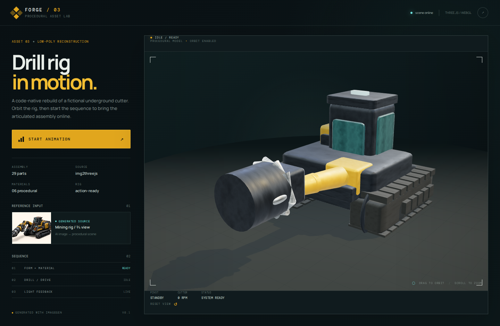

# FORGE / 03 — Underground Drill Rig

Procedural Three.js + Vite asset kit for a cinematic low-poly underground drill rig.

The current product listing and checkout are available at [Crypto-Fi](https://crypto-fi.co/forge-drill-rig) for **12 USDC on Base**.

## Included in the purchase

- editable Three.js/Vite source
- 30-part sculpt specification
- six material presets and a controllable drill animation
- rendered preview images and integration/build documentation
- commercial-use license for finished work

This is a fictional visual asset, not an operational mining design. The concept reference and parts of the implementation were AI-assisted; the package contains an explicit disclosure and third-party notices.

